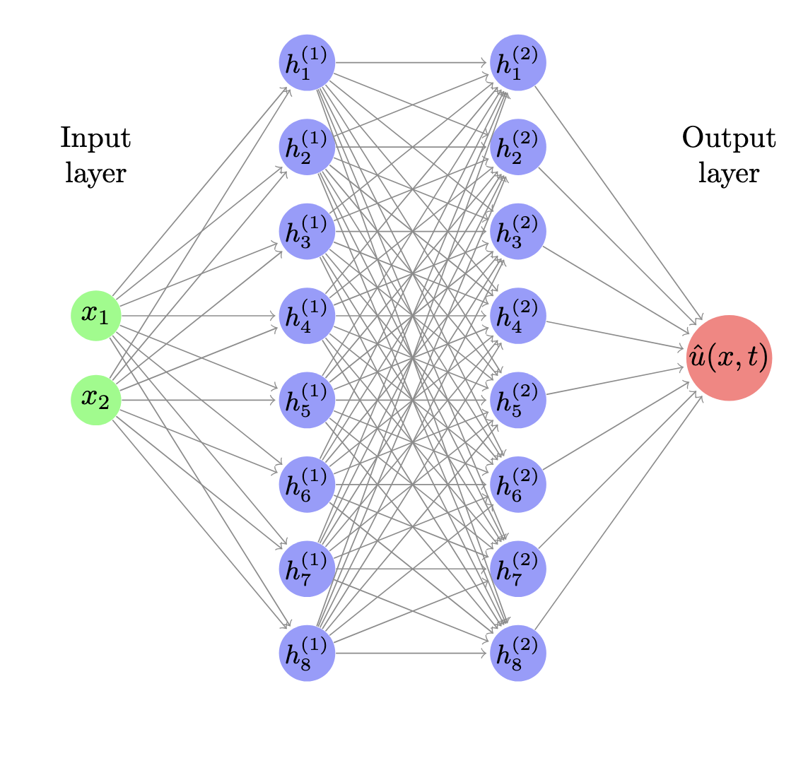

heat equation 1D $u=u(x,t)$
$$
\frac{\partial u}{\partial t}=\alpha \frac{\partial^2 u}{\partial x^2}
$$
boundary conditions, $[0,L]$
$$
u(0,t)=0 \quad
u(L, t)=0
$$
and initial condition
$$
u(x,0)=\sin\left(\frac{\pi}{L} x\right)
$$

